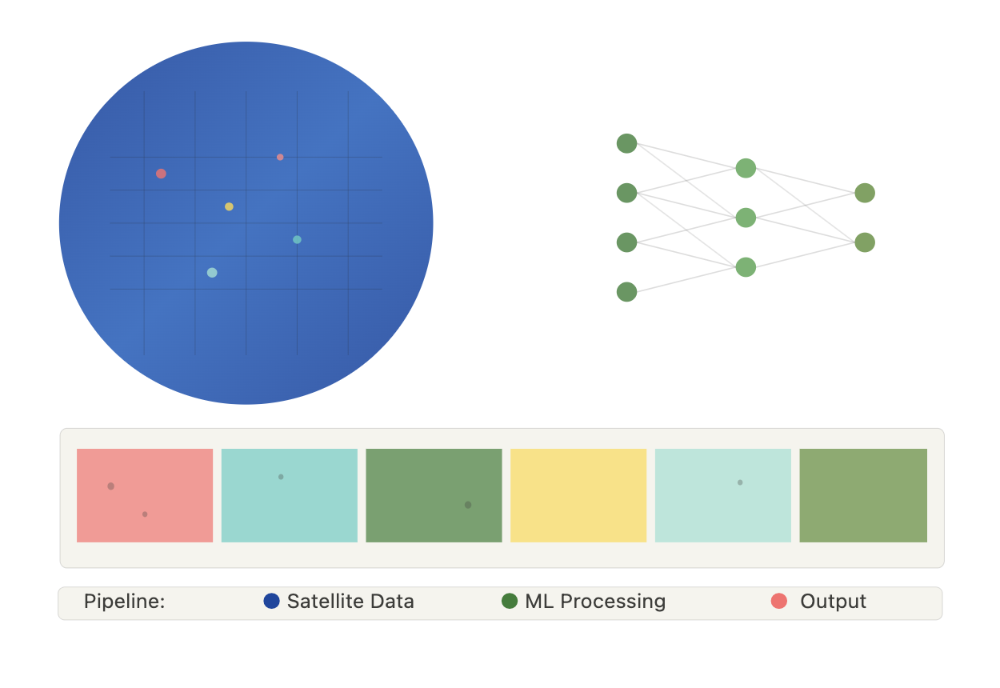
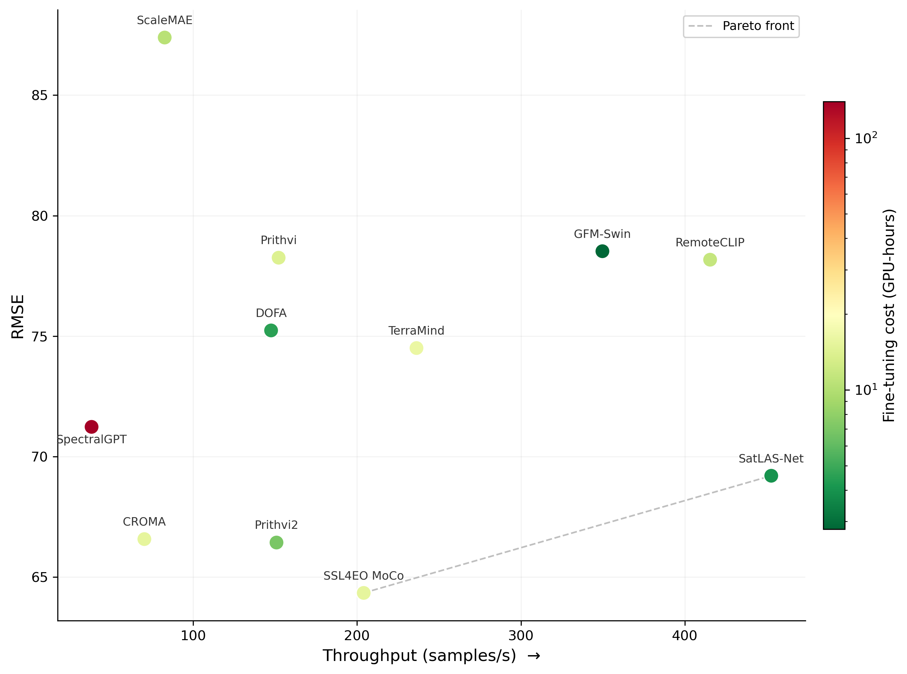
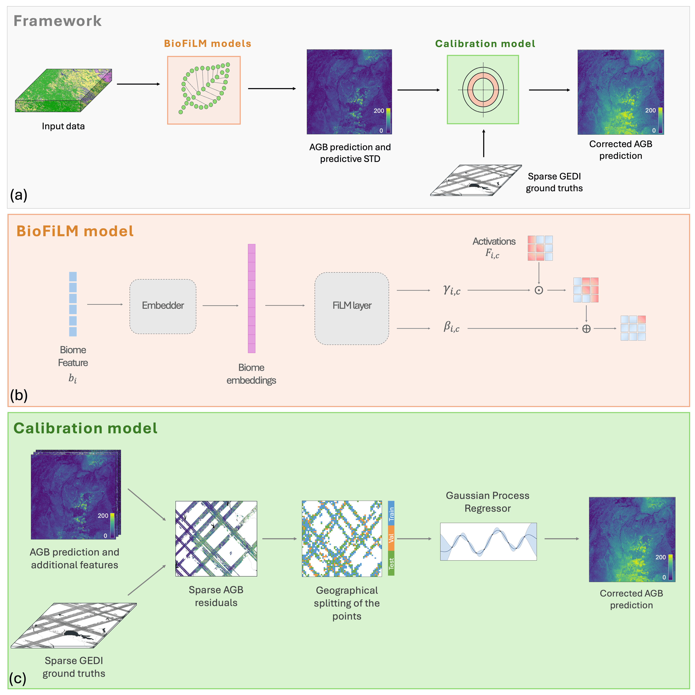
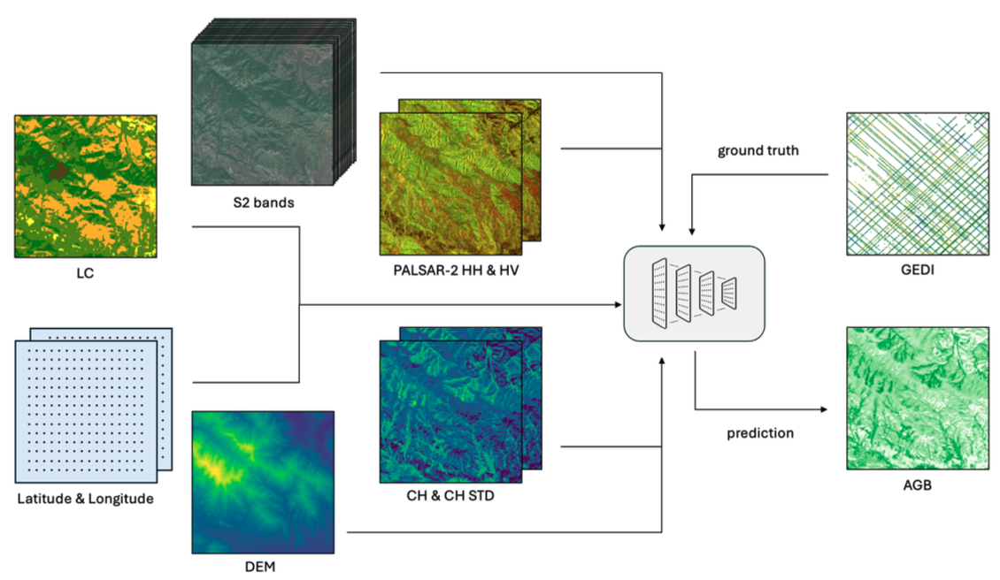
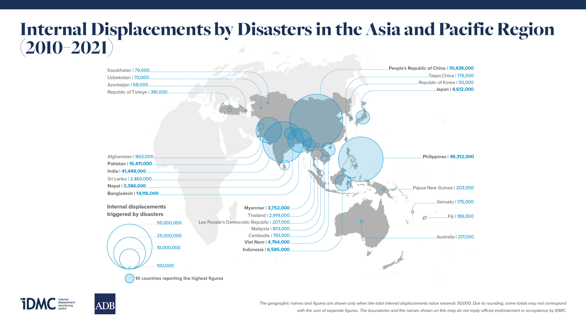

  
    

    

        I am a third year <a href="https://ai.ethz.ch/" target="_blank">ETH AI Center</a> Doctoral fellow, supervised by Prof. Konrad Schindler (ETH, <a href="https://prs.igp.ethz.ch/" target="_blank">PRS</a>) and Prof. Jan Dirk Wegner (UZH, <a href="https://dm3l.uzh.ch/wegner" target="_blank">Ecovision</a>). My research lies at the frontier of computer vision and remote sensing to solve scientific questions in the environmental sciences. In particular, my current work focuses on high-resolution global mapping of above-ground biomass.
          
        I am also the co-founder and an active member of the AI + Environment Summit, a non-profit that organizes the <a href="https://ai-environment-summit.com/" target="_blank">eponymous event</a>. 
          
        I did my MSc at ETH Zurich, and my undergrad at École Polytechnique (Paris).
    

    

 

## 📝 publications

  <!-- Image on the left -->
  

  <!-- Text on the right -->
  

    

      <strong>From Machine Learning to large-scale EO products: Best Practices and Guidelines for making Maps</strong> (In preparation) 
       
      <strong>Ghjulia Sialelli</strong> et al.
    

  

  <!-- Image on the left -->
  

  <!-- Text on the right -->
  

    

      <strong>Above-ground biomass estimation with Geospatial Foundation Models</strong> 
      (In preparation) 
       
      <strong>Ghjulia Sialelli</strong>, Linus Scheibenreif, Jan D. Wegner, Konrad Schindler
    

  

  <!-- Image on the left -->
  

  <!-- Text on the right -->
  

    

      <strong>Gaussian Process Regression for Bias Correction of Satellite-based Biomass Estimates</strong> (Under review) 
       
      <strong>Ghjulia Sialelli</strong>, Torben Peters, Linus Scheibenreif, Jan D. Wegner, Konrad Schindler
    

     
    

      To address the spatially structured residuals and biases typical of large-scale AGB products, we develop a post-hoc calibration scheme using Gaussian Process Regression.
    

  

  <!-- Image on the left -->
  

  <!-- Text on the right -->
  

    

      <strong>AGBD: A Global-scale Biomass Dataset</strong> (ISPRS GSW 2025 Oral) 
      <strong>Ghjulia Sialelli</strong>, Torben Peters, Jan D. Wegner, Konrad Schindler
    

    

      <a href="https://isprs-annals.copernicus.org/articles/X-G-2025/829/2025/" style="background-color: #f47cb4; color: white; padding: 4px 8px; border-radius: 8px; text-decoration: none; font-weight: bold;">🔗 PDF</a>
    

    

      <a href="https://agbdataset.github.io/" style="background-color:rgb(26, 207, 102); color: white; padding: 4px 8px; border-radius: 8px; text-decoration: none; font-weight: bold;">🔗 Project website</a>
    

    

      We introduce a ML-ready dataset and benchmark models, for dense high-resolution global biomass estimation.
    

  

  <!-- Image on the left -->
  

  <!-- Text on the right -->
  

    

      <strong>Disaster Displacement in Asia and the Pacific</strong> (2022) 
      

      Direction and project management: Alexandra Bilak, Bina Desai, and Christelle Cazabat. Project Coordination: Vicente Anzellini and Fanny Teppe. Drafting and Research: Vicente Anzellini, Christelle Cazabat, Pablo Cortés Ferrández, Ricardo Fal-Dutra Santos, Vincent Fung, Kathryn Giffin, Thannaletchimy Housset, Alesia O’Connor, Fanny Teppe, and Louisa Yasukawa. Data and Analysis: Sylvain Ponserre, <strong>Ghjulia Sialelli</strong> and Fanny Teppe. Design, layout, maps and graphs: Vivcie Bendo, Stéphane Kluser (Komplo), Emiliano Pérez, Sylvain Ponserre. Editor: Melanie Kelleher
      

    

    

      <a href="https://www.internal-displacement.org/disaster-displacement-in-asia-and-the-pacific-2022/" style="background-color: #f47cb4; color: white; padding: 4px 8px; border-radius: 8px; text-decoration: none; font-weight: bold;">🔗 Report</a>
    

    

      This report presents the disaster displacement trends in the region during 2010−2021 and provides insights into its social and economic impacts.
    

  

 

## 🔥 news

  <ul style="list-style-type: disc !important; padding-left: 20px; margin: 0;">
    <li style="margin-bottom: 10px;"><strong>March - June 2026</strong> — Research stay at the <a href="https://ridr.se/">Deep Learning Research Group at RISE</a>, hosted by Dr. Olof Mogren.</li>
    <li style="margin-bottom: 10px;"><strong>February 2026</strong> — Presented my research on large-scale biomass estimation at IBM Research Zurich.</li>
    <li style="margin-bottom: 10px;"><strong>January 2026</strong> — Moderated a panel on Sustainable AI at the AI House Davos. Watch the <a href="https://www.youtube.com/watch?v=qLu7L8g-Wy4">recording</a>.</li>
    <li style="margin-bottom: 10px;"><strong>December 2025</strong> — At EurIPS Copenhagen, presenting a poster at the <a href="https://sites.google.com/g.harvard.edu/aicceurips">Workshop on AI for Climate and Conservation</a>.</li>
    <li style="margin-bottom: 10px;"><strong>October 2025</strong> — Chairing the <a href="https://ai-environment-summit.com/">AI + Environment Summit 2025</a>!</li>
    <li style="margin-bottom: 10px;"><strong>June 2025</strong> — At the <a href="https://lps25.esa.int/">Living Planet Symposium</a> in Vienna.</li>
    <li style="margin-bottom: 10px;"><strong>April 2025</strong> — Invited talk for the <a href="https://www.ri.se/en/learningmachinesseminars">RISE Learning Machines</a>.</li>
    <li style="margin-bottom: 10px;"><strong>April 2025</strong> — Poster at <a href="https://www.wids.ch/">WiDS Zurich</a>.</li>
    <li style="margin-bottom: 10px;"><strong>April 2025</strong> — Oral Presentation at ISPRS GSW25.</li>
    <li style="margin-bottom: 10px;"><strong>February 2025</strong> — Featured in the <a href="https://mailchi.mp/3c2a6a700b85/climate-change-ai-newsletter-april-5844816?e=e3c5cd8083">CCAI newsletter</a>.</li>
    <li style="margin-bottom: 10px;"><strong>January 2025</strong> — Publication accepted to <a href="https://gsw2025.ae/">ISPRS GSW 2025</a>.</li>
    <li style="margin-bottom: 10px;"><strong>January 2025</strong> — Tutorial for <a href="https://docs.eval.science/learn/primer">eval.science</a>.</li>
    <li style="margin-bottom: 10px;"><strong>October 2024</strong> — Chairing <a href="https://summit.biodivx.org/">AI + Environment Summit 2024</a>.</li>
    <li style="margin-bottom: 10px;"><strong>September 2024</strong> — Attending ECCV.</li>
    <li style="margin-bottom: 10px;"><strong>May 2024</strong> — Supporting the <a href="https://hack.biodivx.org/">AI + Environment Hackathon</a>.</li>
    <li style="margin-bottom: 10px;"><strong>November 2023</strong> — Supporting AI + Environment Summit 2023.</li>
    <li style="margin-bottom: 10px;"><strong>September 2023</strong> — Starting my PhD at ETH!</li>
  </ul>

 

## 👩‍🎓 supervision

If you are a student interested in working on any of the following topics, feel free to reach out! Topics: super-resolution of remote-sensing products; long-tail distributions; multi-task learning; geospatial foundation models.

Past students
* Chunyang Gao and Dominik Senti (MSc Semester Project), <a href="https://drive.google.com/file/d/1OlnVD6Fw6mD9KA-Fq-QacB2tlwu_EzBE/view?usp=sharing" target="_blank">ICESat-2 spaceborne LiDAR as complementary data source for biomass mapping</a> (2024)
* Noah Kreyenkamp (BSc Thesis), <a href="https://drive.google.com/file/d/1eGPVt3_ir7LKXSMV_HRqwwAl80yHyU2h/view?usp=sharing" target="_blank">Developing a Data Pipeline for Global-Scale Biomass Mapping</a> (2024)
* Nial Perry (MSc Thesis), <a href="https://drive.google.com/file/d/1nelZxR3u0_i0buubRSMh_8Um5go02oWb/view?usp=sharing" target="_blank">Optimizing Biomass Insights: A Multi-Armed Bandit Approach to Coreset Selection</a> (2024)
* Guenole Joubioux (MSc Semester Project) and Angelika Nogueira (BSc Thesis) and Joel Reimann (BSc Thesis), <a href="https://drive.google.com/file/d/1_gt838-tLui6UUxpJgA1VLXtZ-zwyVNY/view?usp=sharing" target="_blank"> Benchmarking of Earth Observation Foundation Models for Above-Ground Biomass Estimation</a> (2025)

 

## 🤝 scientific service

**Reviewing**
* Climate Informatics (2026)
* AI for Public Goods Fast Grants (AI4PG) program (2026)
* Mountain Research and Development Journal (2026)
* EurIPS Workshop on Advances in Representation Learning for Earth Observation (2025)
* CCAI Innovation Grants (2024)
* NeurIPS workshop on Bayesian Decision-making and Uncertainty (2024)

**Event organization**
* AI + Environment Summit (2023-2024-2025-2026)
* AI + Environment Hackathon (2024)

**Teaching**
* Image-Based Mapping, MSc course, 5ECTS (2023-2024-2025) (Teaching Assistant)

 

## 🎤 talks

* Moderator for the  <a href="https://www.youtube.com/watch?v=qLu7L8g-Wy4" target="_blank">AI House Davos 2026 panel on Sustainable AI: From Climate Science to Efficient Computing</a> (2026)
* Invited speaker for the <a href="https://www.ri.se/en/learningmachinesseminars">RISE Learning Machines</a> seminar series (2025)
* Oral presentation at ISPRS GSW25

 

## 📰 media
* <a href="https://ethz-foundation.ch/en/spotlight/uplift-20-ghjulia-sialelli-precision-for-the-planet/" target="_blank">Portrait: Precision for the planet</a>, by Andrea Zeller for the ETH Foundation Uplift magazine

 

## 🔗 links
<table style="width:100%; text-align:center; margin-top: 20px;">
  <tr>
    <td>
      
    </td>
    <td>
      
    </td>
    <td>
      
    </td>
    <td>
      
    </td>
    <td>
      
    </td>
  </tr>
</table>
